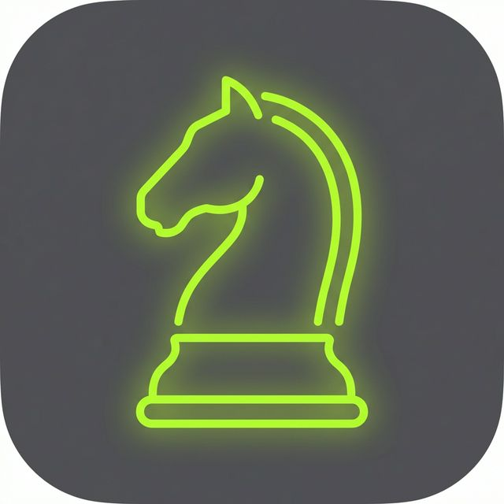
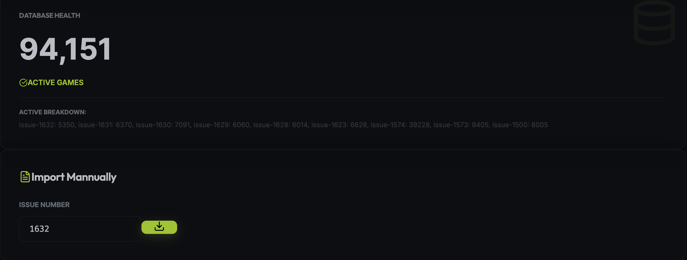
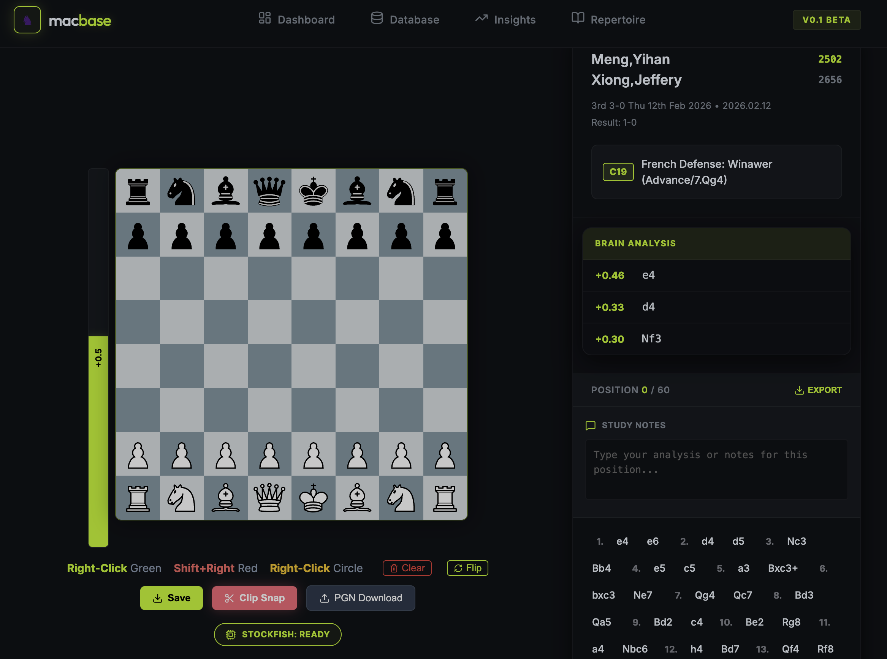
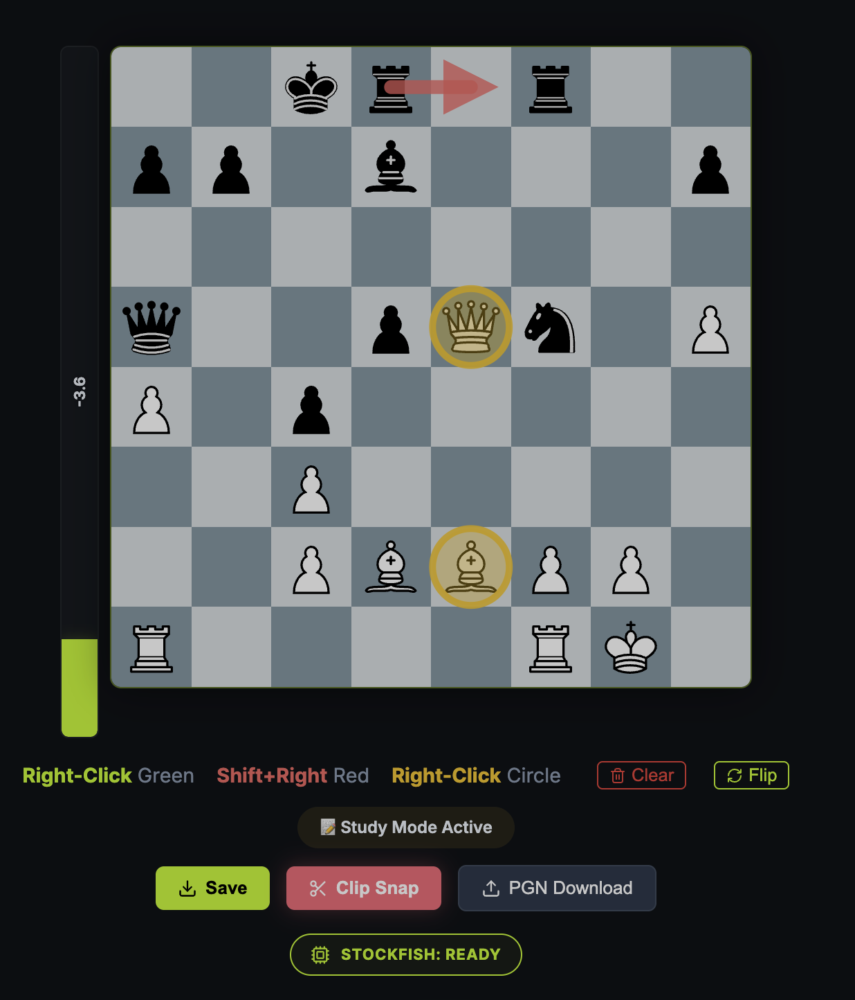
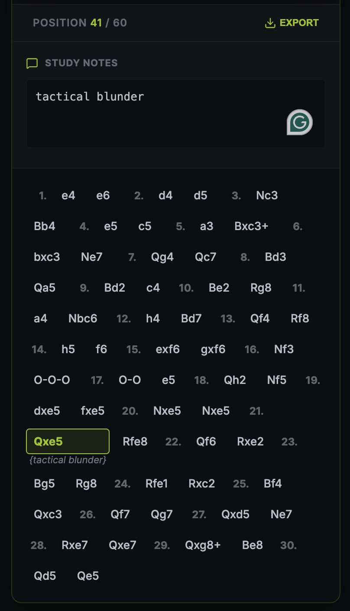
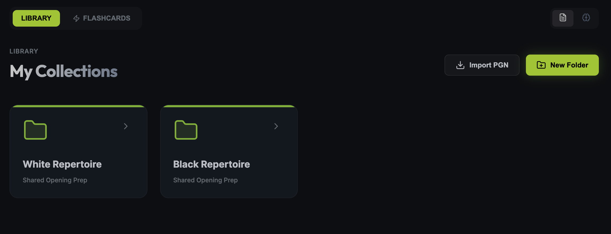
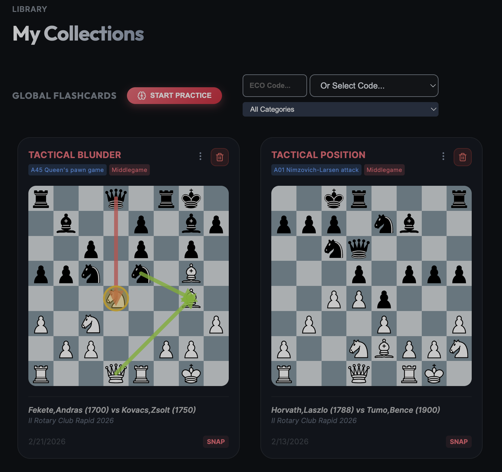
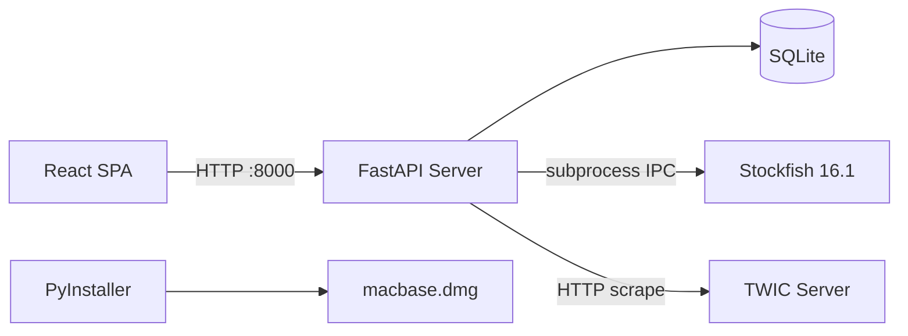
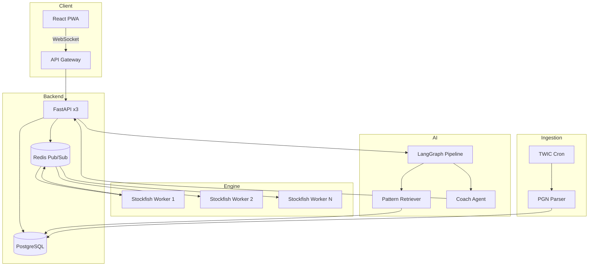

#  macbase

**Stop procrastinating on your OTB analysis with the most beautiful, native chess studio for Mac.**

**[简体中文](README_ZH.md)** • English

Macbase provides a distraction-free, world-class interface for analyzing the tournament games you've been putting off, helping you turn "logged games" into "learned lessons" so you can get back to the OTB board stronger.

[**Download macbase Pro**](https://joe-ging.github.io/macbase-app/) • [**Star on GitHub**](https://github.com/joe-ging/macbase)

---

### 🚨 **CRITICAL: CLONING VS. DOWNLOADING**
**This repository contains the Community Core only.** 

Cloning this repo allows you to see the architecture and contribute to the foundational engine. However, to get the **full professional experience**—including the AI Coach "Neural Link," automated TWIC synchronization, and professional Tactical Insights—you **must** download the official DMG distribution.

👉 [**Download the Full Pro Experience here**](https://joe-ging.github.io/macbase-app/)

---

### 📊 **COMMUNITY MOMENTUM (As of Feb 25, 2026)**
The demand for a native Mac chess studio is real. In our silent community preview:
- 📈 **493 Total Clones** in the last 14 days.
- 👤 **211 Unique Developers/Players** have deployed this from their terminals.
- ⭐ **0 Stars... so far!**

<p align="center">
  
</p> 

**The Hidden Demand:** If you are one of the 200+ users who cloned the repo but haven't starred it yet—please leave a ⭐ Star! It's the only way we can bypass the "New Project" stigma and hit our next milestone to unlock the AI Coach.

---

## 🌟 Support the Project (Supporters Wall)
We want to celebrate our early community! 

**The Incentive:** Whomever stars this project on GitHub **during the launch week** will have their handle added to our **Supporters Wall** in the next release. 

---

### 🚀 **MILESTONE: 15 STARS UNLOCKS 'NEURAL LINK'**
Once this project hits **15 Stars**, we will begin incorporating the **Claude-powered AI Coach** directly into the Macbase ecosystem.

**The Vision:**
Imagine finishing a blitz session on Lichess.org, then instantly receiving core improvement insights and tactical blindspot alerts pushed directly to your **macbase desktop** and your **WhatsApp/Telegram** via our Neural Link engine.

No more manual analysis. No more procrastinating. Just pure, automated growth.

[**⭐ Star this Repo now to push the roadmap forward**](https://github.com/joe-ging/macbase)

---

## 🌎 Open Core Model
Macbase follows an **Open Core** model. We believe professional technical tools should have a transparent foundation. 
- **The Community Core (This Repo):** The foundational chess engine, database architecture, and native macOS desktop framework. 
- **The Pro Distribution:** Proprietary features like the AI Coach, cloud-sync repertoire, and professional game insights.

---

## 🖼️ Feature Showcase (The Full Tour)

### 1. Unified Dashboard
Stay at the center of the chess world. Monitor your progress, track database size, and import the latest professional games with a single click.
<p align="center">
  
  
</p>

### 2. Live Analysis & Tactics
Native Multi-PV Stockfish 16.1 integration. Draw tactical arrows, highlight squares, and annotate games with professional clarity.
<p align="center">
  
  
  
</p>

### 3. Master Intelligence Database
Lightning-fast filtering of millions of games. Search by ECO code, player, rating, or year.
<p align="center">
  
  
  
</p>

### 4. Pro Insights & Blindspot Detection
Identify exactly where your game is breaking. Analyze your own PGNs to find recurring tactical themes and opening mistakes.
<p align="center">
  
  
</p>

### 5. Repertoire Architect & Flashcards
Build your white and black repertoire and practice it daily using our native spaced-repetition engine.
<p align="center">
  
  
</p>

---


---

## 🏗️ System Architecture

### Current Architecture (Desktop)

**Stack:** React (Vite) · FastAPI · SQLite · Stockfish 16.1 · PyInstaller (.dmg)

```
Frontend (React/Vite)           Backend (FastAPI)              External
┌───────────────────────┐      ┌────────────────────┐      ┌─────────────┐
│ react-chessboard      │      │ main.py            │      │ Stockfish   │
│ chess.js (move logic) │─HTTP─│ SQLAlchemy ORM     │      │ 16.1 C++    │
│ recharts (analytics)  │:8000 │ PGN parser         │──IPC─│ (subprocess)│
│ react-router-dom      │      │ ECO lookup engine  │      └─────────────┘
│ 5 pages:              │      │ TWIC web scraper   │
│  Dashboard            │◄JSON─│ Background tasks   │      ┌─────────────┐
│  Analysis             │      │ Insights endpoint  │──HTTP─│ TWIC Server │
│  Database             │      └────────────────────┘      │ (chess news)│
│  Insights             │              │                    └─────────────┘
│  Repertoire           │      ┌───────┴────────┐
└───────────────────────┘      │ SQLite (local) │
                               │ ~/.macbase/    │
                               │  macbase.db    │
                               └────────────────┘
```

#### How It Works

1. **Frontend**: React SPA (Vite), 5 pages. Uses react-chessboard for board rendering, chess.js for move validation, recharts for charts.
2. **Backend**: FastAPI bundled via PyInstaller into .dmg. SQLAlchemy ORM with 4 tables stored in local SQLite at ~/.macbase/.
3. **Stockfish**: C++ engine spawned as subprocess via IPC. Runs on background thread with async event listeners to avoid UI freezing.
4. **TWIC Sync**: Web scraper fetches latest pro games, parses PGN, bulk-inserts with ECO code enrichment.
5. **Distribution**: PyInstaller bundles everything into a single .dmg.

#### Current Architecture Diagram



#### C4 Architecture

| Level | Components |
|:---|:---|
| **C1 Context** | User ↔ Macbase ↔ Stockfish ↔ TWIC |
| **C2 Container** | React UI / FastAPI / SQLite / Stockfish Process |
| **C3 Component** | database.py / twic_service.py / eco_lookup.py / insights_endpoint.py |
| **C4 Code** | Game model (15 cols) / RepertoireFolder / TWIC cache (1hr TTL) |

#### Key Challenges Solved

1. **UI Freeze**: Stockfish takes 2-10s per position. Background thread + async event listener pushes results without blocking render.
2. **PyInstaller stdout Crash**: macOS windowed apps have no stdout. Redirected to temp log on frozen app detection.
3. **PGN at Scale**: TWIC issues contain 2000+ games. Chunked transactions + binary ECO lookup.

---

### Production Architecture (Cloud-Native Vision)

**Vision:** Single-user Mac app → multi-user cloud platform with real-time AI coaching

| Aspect | Current | Cloud-Native | Why |
|:---|:---|:---|:---|
| **Frontend** | React in PyInstaller | React PWA | Cross-platform |
| **Backend** | Single FastAPI | FastAPI + Celery on K8s | Scale across users |
| **Database** | SQLite local | PostgreSQL + Redis | Multi-user |
| **Engine** | Local subprocess | Stockfish worker pool | Shared resources |
| **Real-time** | HTTP polling | WebSocket + Redis Pub/Sub | Live board sync |
| **AI Coach** | Roadmap | Claude/Gemini via LangGraph | NL game review |

#### Real-time Analysis Flow

1. User moves piece → WebSocket → FastAPI Gateway
2. Gateway publishes position to Redis Pub/Sub
3. Stockfish Worker Pool picks up job (K8s auto-scaled)
4. Result → Redis → WebSocket push → UI updates in real-time
5. Positions cached in Redis LRU — repeats return in <10ms

#### AI Coach Flow (Neural Link)

1. Game complete → LangGraph pipeline
2. Router Agent classifies game phase
3. Retrieval Agent searches user history for patterns
4. Coach Agent generates personalized improvement plan

#### Production Architecture Diagram




---

## 🚀 Installation (How to get the App)

Because we are in a limited Beta launch (**Free for the first 100 users**), we distribute the app through our official storefront to ensure you receive the full Pro Beta experience.

### **1. Download & Move**
1. **Visit** the [Official Storefront](https://joe-ging.github.io/macbase-app/).
2. **Claim your copy** by providing your email (to receive your download link).
3. **Download** the `macbase.dmg`.
4. **Move** the `macbase` app to your **Applications** folder.

### **2. Bypassing macOS Gatekeeper (Critical Step)**
Since macbase is an independent indie project and currently unsigned, macOS will flag it as "blocked" or "malware". Use one of the two methods below:

#### **Method A: The Classic Shortcut (Legacy macOS)**
- **Right-Click (or Control-Click)** the `macbase` icon in your Applications folder and select **Open**.
- **Note:** This method is largely obsolete in macOS 15+ (Sequoia) and 16+ (Tahoe).

#### **Method B: System Settings (If Method A fails)**
1. Double-click the app. When the "Blocked" warning appears, click **OK**.
2. **Immediately** open **System Settings** ➡️ **Privacy & Security** (the button only appears for 5 minutes after the failure).
3. Scroll down to the **Security** section and look for the **Open Anyway** button.
4. Enter your Mac password when prompted.

#### **Method C: The Sequoia/Tahoe Command Line Fix (Recommended)**
If the "Open Anyway" button does not appear (a known bug in Sequoia) or fails, open your **Terminal** and run:
```bash
sudo xattr -cr /Applications/macbase.app
```
This removes the quarantine flag and allows the app to run instantly.

#### **Method D: The DMG Recovery Fix (If the DMG won't open)**
On macOS Sequoia/Tahoe, sometimes the `.dmg` file itself refuses to mount even with "Anywhere" enabled. Use this command to force-mount:
```bash
hdiutil attach -noverify ~/Downloads/macbase.dmg
```

#### **Method E: Run from Source (The Unblockable Fallback)**
Since macbase is Open Core, you can always bypass binary restrictions by running the source code directly:
1. Clone this repository.
2. Follow the **Development Setup** instructions below.
3. **Why:** macOS never blocks interpreted code (Python/Node.js).

---

## 🛠️ Development Setup

If you want to contribute to the Community Core or build from source:

### Prerequisites
- Python 3.12+
- Node.js 20+
- [Stockfish](https://stockfishchess.org/download/)

### Steps
1. **Clone & Setup:**
   ```bash
   git clone https://github.com/joe-ging/macbase.git
   cd macbase
   ./toggle_pro.py core
   ```
2. **Backend:** Install requirements in `backend/requirements.txt` and run `main.py`.
3. **Frontend:** Run `npm install` and `npm run dev` in the `frontend` directory.

---

## 🚩 Feedback & Bug Reports
Found a bug? Use our Launch Feedback Form:
👉 [**Report an Issue / Give Feedback**](https://tally.so/r/jayppa)

---


---

## 🙏 Credits
- **Game Data:** [The Week in Chess (TWIC)](https://theweekinchess.com/)
- **Engine:** [Stockfish Chess](https://stockfishchess.org/)
- **Built with:** FastAPI, React, SQLite.

## 📄 License
MIT © [joe-ging](https://github.com/joe-ging)
